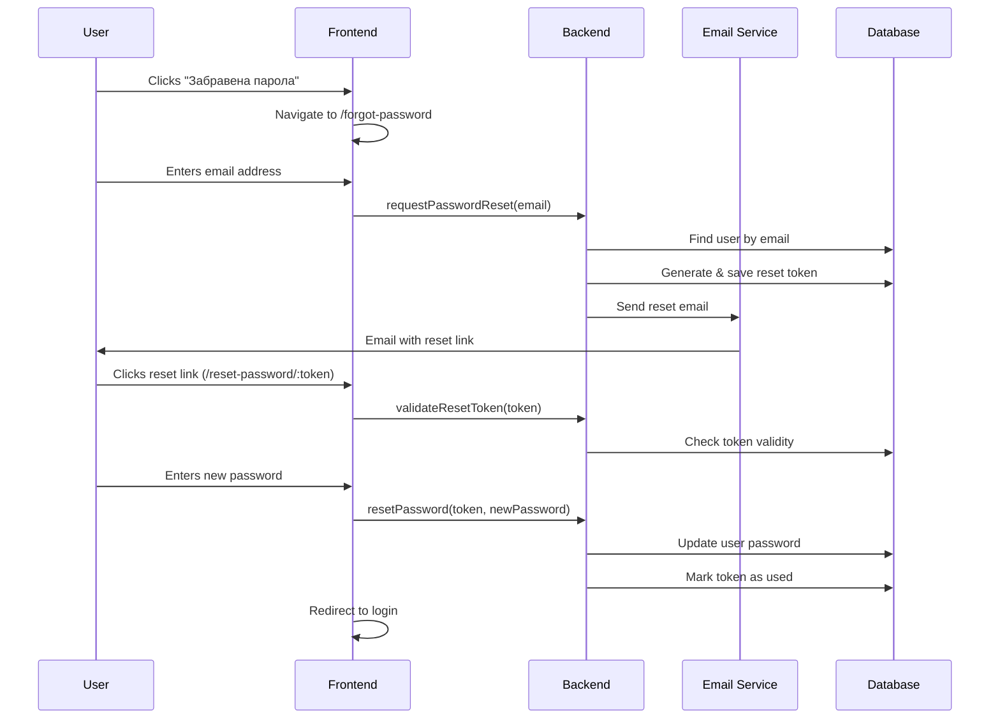
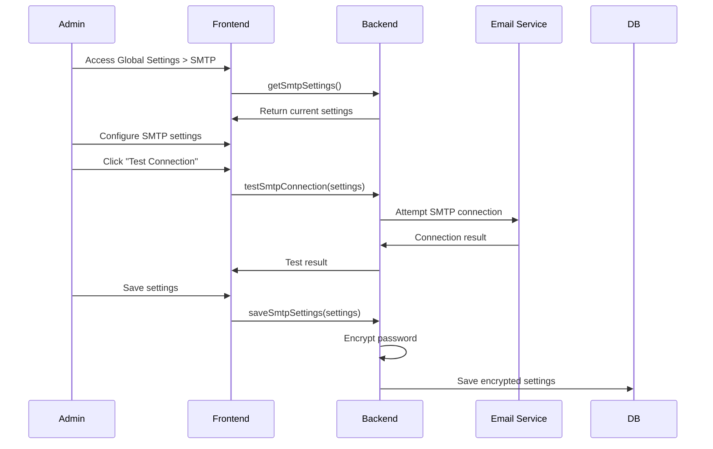

# 📧 SMTP & Password Reset System Architecture

## 🎯 Общ преглед на системата

Система за управление на SMTP настройки и възстановяване на пароли за USER и ADMIN потребители в invoice приложението. SUPER_ADMIN остава само с Linux скрипт управление.

## 🗄️ Database Schema

### 1. SMTP Settings Table
```sql
CREATE TABLE smtp_settings (
    id BIGSERIAL PRIMARY KEY,
    host VARCHAR(255) NOT NULL,
    port INTEGER NOT NULL DEFAULT 587,
    username VARCHAR(255) NOT NULL,
    password VARCHAR(512) NOT NULL, -- encrypted
    sender_email VARCHAR(255) NOT NULL,
    sender_name VARCHAR(255),
    use_tls BOOLEAN DEFAULT true,
    use_ssl BOOLEAN DEFAULT false,
    is_active BOOLEAN DEFAULT true,
    created_at TIMESTAMP DEFAULT CURRENT_TIMESTAMP,
    updated_at TIMESTAMP DEFAULT CURRENT_TIMESTAMP
);
```

### 2. Password Reset Tokens Table
```sql
CREATE TABLE password_reset_tokens (
    id BIGSERIAL PRIMARY KEY,
    user_id BIGINT NOT NULL,
    token VARCHAR(255) NOT NULL UNIQUE,
    expires_at TIMESTAMP NOT NULL,
    used_at TIMESTAMP NULL,
    created_at TIMESTAMP DEFAULT CURRENT_TIMESTAMP,
    FOREIGN KEY (user_id) REFERENCES users(id) ON DELETE CASCADE
);

-- Index за performance
CREATE INDEX idx_password_reset_tokens_token ON password_reset_tokens(token);
CREATE INDEX idx_password_reset_tokens_user_id ON password_reset_tokens(user_id);
CREATE INDEX idx_password_reset_tokens_expires_at ON password_reset_tokens(expires_at);
```

## 🏗️ Backend Architecture

### 1. Models

#### SmtpSettings.java
```java
@Entity
@Table(name = "smtp_settings")
public class SmtpSettings {
    @Id @GeneratedValue(strategy = GenerationType.IDENTITY)
    private Long id;
    
    @Column(nullable = false)
    private String host;
    
    @Column(nullable = false)
    private Integer port = 587;
    
    @Column(nullable = false)
    private String username;
    
    @Column(nullable = false, length = 512)
    private String password; // encrypted
    
    @Column(nullable = false)
    private String senderEmail;
    
    private String senderName;
    
    @Column(nullable = false)
    private Boolean useTls = true;
    
    @Column(nullable = false)
    private Boolean useSsl = false;
    
    @Column(nullable = false)
    private Boolean isActive = true;
    
    // timestamps, getters, setters
}
```

#### PasswordResetToken.java
```java
@Entity
@Table(name = "password_reset_tokens")
public class PasswordResetToken {
    @Id @GeneratedValue(strategy = GenerationType.IDENTITY)
    private Long id;
    
    @ManyToOne(fetch = FetchType.LAZY)
    @JoinColumn(name = "user_id", nullable = false)
    private User user;
    
    @Column(nullable = false, unique = true)
    private String token;
    
    @Column(nullable = false)
    private LocalDateTime expiresAt;
    
    private LocalDateTime usedAt;
    
    // getters, setters
}
```

### 2. Services

#### EmailService.java
```java
@Service
public class EmailService {
    
    public void sendPasswordResetEmail(User user, String resetToken);
    public void sendTestEmail(String recipient);
    public boolean validateSmtpConnection(SmtpSettings settings);
    
    private JavaMailSender createMailSender(SmtpSettings settings);
}
```

#### PasswordResetService.java
```java
@Service
public class PasswordResetService {
    
    public String generateResetToken(String email);
    public boolean validateResetToken(String token);
    public boolean resetPassword(String token, String newPassword);
    public void cleanupExpiredTokens();
    
    private String generateSecureToken();
    private boolean isTokenValid(PasswordResetToken token);
}
```

#### SmtpSettingsService.java
```java
@Service
public class SmtpSettingsService {
    
    public SmtpSettings getActiveSettings();
    public SmtpSettings saveSettings(SmtpSettings settings);
    public boolean testConnection(SmtpSettings settings);
    
    private String encryptPassword(String password);
    private String decryptPassword(String encryptedPassword);
}
```

### 3. Controllers

#### SmtpController.java
```java
@Controller
public class SmtpController {
    
    @QueryMapping
    public SmtpSettings getSmtpSettings();
    
    @MutationMapping
    public SmtpSettings saveSmtpSettings(@Argument SmtpSettingsInput input);
    
    @MutationMapping
    public Boolean testSmtpConnection(@Argument SmtpSettingsInput input);
}
```

#### PasswordResetController.java
```java
@Controller
public class PasswordResetController {
    
    @MutationMapping
    public Boolean requestPasswordReset(@Argument String email);
    
    @MutationMapping
    public Boolean resetPassword(@Argument String token, @Argument String newPassword);
    
    @QueryMapping
    public Boolean validateResetToken(@Argument String token);
}
```

## 🖥️ Frontend Architecture

### 1. SMTP Settings Management (Global Settings)

#### Нов таб: "SMTP настройки"
```jsx
// В GlobalSettings.jsx
<Tab label="SMTP настройки" {...a11yProps(4)} />

<TabPanel value={tabValue} index={4}>
  <SmtpSettingsPanel />
</TabPanel>
```

#### SmtpSettingsPanel Component
```jsx
const SmtpSettingsPanel = () => {
  const [smtpForm, setSmtpForm] = useState({
    host: '',
    port: 587,
    username: '',
    password: '',
    senderEmail: '',
    senderName: '',
    useTls: true,
    useSsl: false
  });
  
  // CRUD operations, test connection
};
```

### 2. Password Reset Flow

#### ForgotPassword Component
```jsx
// Нова страница: /forgot-password
const ForgotPassword = () => {
  const [email, setEmail] = useState('');
  const [isSubmitted, setIsSubmitted] = useState(false);
  
  const handleSubmit = async () => {
    await requestPasswordReset({ variables: { email } });
    setIsSubmitted(true);
  };
};
```

#### ResetPassword Component
```jsx
// Нова страница: /reset-password/:token
const ResetPassword = () => {
  const { token } = useParams();
  const [passwords, setPasswords] = useState({
    newPassword: '',
    confirmPassword: ''
  });
  
  const handleSubmit = async () => {
    await resetPassword({ 
      variables: { token, newPassword: passwords.newPassword } 
    });
  };
};
```

## 🔄 Business Logic Flow

### 1. Password Reset Process


```mermaid
sequenceDiagram
    participant U as User
    participant F as Frontend
    participant B as Backend
    participant E as Email Service
    participant DB as Database

    U->>F: Clicks "Забравена парола"
    F->>F: Navigate to /forgot-password
    U->>F: Enters email address
    F->>B: requestPasswordReset(email)
    B->>DB: Find user by email
    B->>DB: Generate & save reset token
    B->>E: Send reset email
    E->>U: Email with reset link
    U->>F: Clicks reset link (/reset-password/:token)
    F->>B: validateResetToken(token)
    B->>DB: Check token validity
    U->>F: Enters new password
    F->>B: resetPassword(token, newPassword)
    B->>DB: Update user password
    B->>DB: Mark token as used
    F->>F: Redirect to login
```

### 2. SMTP Configuration Flow


```mermaid
sequenceDiagram
    participant A as Admin
    participant F as Frontend
    participant B as Backend
    participant E as Email Service

    A->>F: Access Global Settings > SMTP
    F->>B: getSmtpSettings()
    B->>F: Return current settings
    A->>F: Configure SMTP settings
    A->>F: Click "Test Connection"
    F->>B: testSmtpConnection(settings)
    B->>E: Attempt SMTP connection
    E->>B: Connection result
    B->>F: Test result
    A->>F: Save settings
    F->>B: saveSmtpSettings(settings)
    B->>B: Encrypt password
    B->>DB: Save encrypted settings
```

## 🔐 Security Considerations

### 1. Password Encryption
- SMTP passwords encrypted with AES-256
- Reset tokens are UUID + timestamp based
- Token expiration: 1 hour

### 2. Access Control
- SMTP settings: только SUPER_ADMIN (через Linux script)
- Password reset: USER & ADMIN roles only
- Rate limiting на password reset requests

### 3. Email Security
- Mandatory TLS for SMTP connections
- Email templates sanitized
- Reset links with HTTPS only

## 📱 UI/UX Considerations

### 1. SMTP Settings Form
- Connection test with real-time feedback
- Password field with show/hide toggle
- SSL/TLS radio buttons
- Sender email validation

### 2. Password Reset UI
- Clear error messages
- Progress indicators
- Password strength indicator
- Responsive design for email links

## 🚀 Implementation Phases

### Phase 1: Database & Backend
1. Create database tables
2. Implement models and repositories
3. Create services for SMTP and password reset
4. Add GraphQL controllers

### Phase 2: Email Infrastructure
1. Configure JavaMail integration
2. Create email templates
3. Implement encryption for SMTP passwords
4. Add connection testing

### Phase 3: Frontend Implementation
1. SMTP settings management in Global Settings
2. Forgot password page
3. Reset password page
4. Integration with existing login flow

### Phase 4: Testing & Security
1. Unit tests for all services
2. Integration tests for email flow
3. Security audit
4. Performance testing

## 🔧 Technical Dependencies

### Backend:
- Spring Boot Mail Starter
- JavaMail API
- AES Encryption utilities
- UUID generation

### Frontend:
- React Router for new pages
- Form validation
- Email format validation
- Password strength indicator

## 🎯 Future Extensions

1. **PDF Invoice Emailing** (следваща задача)
   - Използване на същите SMTP настройки
   - PDF attachment support
   - Email templates за фактури

2. **Email Templates Management**
   - Dynamic email content
   - Multi-language support
   - Company branding

3. **Advanced Security**
   - 2FA integration
   - OAuth SMTP providers
   - Audit logging

## 📋 Implementation Checklist

### Database Layer
- [ ] Create smtp_settings table
- [ ] Create password_reset_tokens table
- [ ] Add necessary indexes
- [ ] Create migration scripts

### Backend Models
- [ ] SmtpSettings entity
- [ ] PasswordResetToken entity
- [ ] Repository interfaces
- [ ] DTO classes

### Backend Services
- [ ] SmtpSettingsService
- [ ] PasswordResetService
- [ ] EmailService
- [ ] EncryptionService

### Backend Controllers
- [ ] SmtpController (GraphQL)
- [ ] PasswordResetController (GraphQL)
- [ ] Update schema.graphqls

### Frontend Components
- [ ] SMTP Settings Panel
- [ ] Forgot Password page
- [ ] Reset Password page
- [ ] Email validation utilities

### Integration & Testing
- [ ] SMTP connection testing
- [ ] Email sending functionality
- [ ] Password reset flow testing
- [ ] Security testing

---

**🏗️ Готов за имплементация! Архитектурата е завършена и готова за development.**